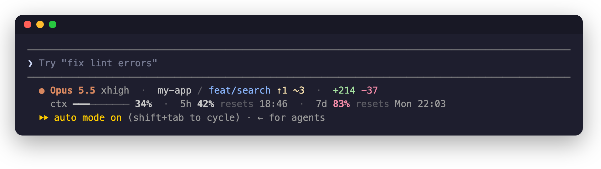
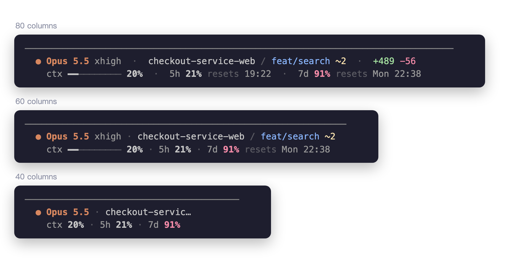
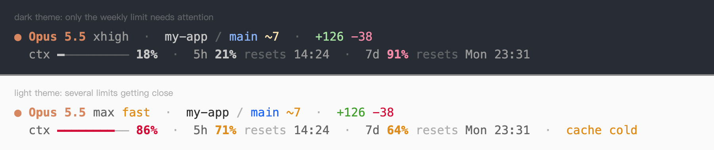

# claude-statusline-sh

[](https://github.com/nagameTW/claude-statusline-sh/actions/workflows/ci.yml)
[](LICENSE)

A quiet, two-line statusline for [Claude Code](https://code.claude.com/docs/en/statusline). It's a single bash script, and the only dependency is `jq`.



[Report a bug](../../issues/new?template=bug_report.yml) · [Request a feature](../../issues/new?template=feature_request.yml)

Colour means state here. A usage meter stays grey while it's fine, turns yellow at 60% and red at 80%, so the number you need to look at is the only one that stands out.

## What it shows

**Line 1:** the model and its effort level, `fast` when fast mode is on, the project, the git branch, and the lines added and removed this session.

Next to the branch, `↑2` means two commits not pushed yet, `↓1` one commit to pull, and `~3` three changed files, untracked ones included.

**Line 2:**

- `ctx`: how much of the context window is used.
- `5h` and `7d`: how much of your 5-hour and weekly limits you've used, and when each one resets.
- `cache cold`: the prompt cache has expired, so the next message has to build it again.

If Claude Code hasn't sent a value yet, the statusline leaves it out instead of showing a zero. The usage limits only appear on Pro and Max plans, after the first response in a session.

## Install

You need bash 3.2 or newer (the one that ships with macOS is fine) and `jq`.

```sh
curl -fsSL https://raw.githubusercontent.com/nagameTW/claude-statusline-sh/main/claude-statusline.sh -o ~/.claude/claude-statusline.sh
```

Then point Claude Code at it in `~/.claude/settings.json`:

```json
{
  "statusLine": {
    "type": "command",
    "command": "bash \"$HOME\"/.claude/claude-statusline.sh"
  }
}
```

It shows up the next time the status line refreshes, which happens after your next message.

## Platforms

- **macOS and Linux**, WSL included. CI runs the tests on the bash 3.2 that ships with macOS and on Ubuntu's bash 5.
- **Windows**, through Git Bash. When Git Bash is installed, Claude Code runs status line commands with it, and CI runs the tests there too. Git for Windows doesn't include `jq`, so install it first with `winget install jqlang.jq`, and keep forward slashes in the command path. Without Git Bash, Claude Code falls back to PowerShell, which can't run the script.

## Narrow terminals

In a split pane, each line gives up details one at a time instead of cutting off whatever is on the right. The gaps tighten first. Then line 1 drops the line counts, the effort level, the end of a long project name, and the branch. Line 2 drops the reset times of meters that are fine, the context bar, and last the reset time of a meter that needs attention. All three percentages stay on screen down to about 35 columns.



## Options

- `NO_COLOR=1` turns colour off, following [no-color.org](https://no-color.org). Put it in the command: `"command": "NO_COLOR=1 bash \"$HOME\"/.claude/claude-statusline.sh"`.
- `CLAUDE_STATUSLINE_THEME=light` or `dark` picks the palette when the automatic choice is wrong (see [Colours](#colours)).
- Git info is cached for 5 seconds per directory in `~/.cache/claude-statusline-sh`, or `$XDG_CACHE_HOME/claude-statusline-sh` if you set that. Claude Code only reruns the status line when something happens in the session. If other tools change the repo while the session sits idle, add `"refreshInterval": 5` to the `statusLine` block.

The thresholds and colours are constants at the top of `claude-statusline.sh`. The file is short, so editing it is the configuration.

## Colours

Claude Code draws the whole status line in its own grey, and it turns "default colour" back into that grey. The script builds three shades on top of it: a brighter grey for names and values, Claude Code's grey for labels, and a dim grey for separators and the word "resets". The state colours (yellow, red, blue, green) come from your terminal's palette, and the model name is always orange.

The brighter grey has to go the other way on a light background, so the script reads the `theme` setting in `~/.claude.json` and switches to a dark grey for the light themes. If you use the `auto` theme on a light terminal, set `CLAUDE_STATUSLINE_THEME=light` in the command.



## Development

```sh
./test.sh                        # fixed inputs, expected output
shellcheck claude-statusline.sh test.sh
```

CI runs the tests on Linux (bash 5, GNU `date`) and on macOS (bash 3.2, BSD `date`).

To try an input by hand:

```sh
echo '{"model":{"display_name":"Opus 5.5"},"context_window":{"used_percentage":42}}' | bash claude-statusline.sh
```

If you want themes, Powerline glyphs or a configuration UI, [ccstatusline](https://github.com/sirmalloc/ccstatusline) does a lot more. This one is for people who would rather read one small file.

## License

[MIT](LICENSE). This project is not affiliated with Anthropic.
